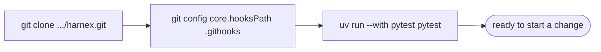
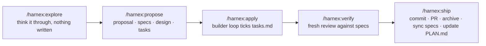

<div align="center">


# harnex

**A public, reusable harness for AI coding agents, used from Claude Code.**

[](docs/PLAN.md)
[](LICENSE)
[](https://docs.claude.com/en/docs/claude-code)
[](https://github.com/Fission-AI/OpenSpec)

</div>

---

> **Agent = Model + Harness.**
> The model reasons; the harness is everything around it that lets it act safely and
> verifiably: instructions and memory, tools, the agentic loop, guardrails, and
> verification. harnex centralises the generic parts of that so a project gets them in
> one command instead of rebuilding them.

> [!NOTE]
> **Verified against:**
>
> | | |
> |---|---|
> | **Claude Code** | `2.1.285` |
> | **Codex** | `codex@openai-codex` plugin `1.0.6`, `codex-cli` `0.158.0` |
> | **OpenSpec** | `1.11.0` |
>
> The full plan, with diagrams, is in [`docs/PLAN.md`](docs/PLAN.md); the manual checks
> are in [`docs/smoke.md`](docs/smoke.md).

## ✨ What it gives you

| | |
|---|---|
| **Five commands** | `explore`, `propose`, `apply`, `verify`, `ship` — a spec-driven change from idea to pull request, inside Claude Code. Specs are kept by [OpenSpec](https://github.com/Fission-AI/OpenSpec) underneath; you never call it. |
| **Setup and update** | `/harnex:setup` brings a project to a harnessed state on your explicit yes; `/harnex:update` refreshes the harness-owned files afterwards, from what setup already recorded, asking nothing. |
| **Division of labour** | Claude plans and reviews; [OpenAI Codex](https://developers.openai.com/codex) builds, reached through its official Claude Code plugin; a small **decision model** (TypeSafe's Jev today, swappable) picks which tool and model runs each delegated step and says so on screen; you approve what is irreversible. |
| **A shell guard** | Decides before any command runs: deterministic rules first, the decision model for the ambiguous rest, never a silent allow on its own error — backed by a permission floor in the project's settings for when the hook itself cannot run. |
| **A canary** | If you want one: every answer must end with a word you choose. When it goes missing, that instruction was not followed — a cheap sign the rules may have dropped out of the context. |
| **Rule sets** | Git, code, spec-driven work, safety, language — written once, rendered into each project, and enforced by hooks where they can be. |

## 🧩 How it is organised

A harness has five pillars, and the plugin's directories are the pillars:

| | Pillar | Directory | Holds |
|---|---|---|---|
| 1 | Context & Memory | `plugin/context/` | rule sets, instruction templates, progress conventions |
| 2 | Action & Tools | `plugin/tools/` | MCP declarations, stack profiles |
| 3 | Orchestration | `plugin/orchestration/` | the workflow, the roles, the decision questions |
| 4 | Control & Guardrails | `plugin/control/` | permissions, the shell guard, what always asks you |
| 5 | Feedback & Verification | `plugin/feedback/` | the check command, the canary check, the decision journal |

The commands, skills, agents and hooks that Claude Code loads sit at the plugin root, as
Claude Code expects; each one belongs to one pillar.

## 📦 Installing it

This installs the harnex **plugin** into a project you want to harness. To work on
harnex's own code instead, see "🛠 Developing harnex" below.

Once per machine:

```bash
claude plugin marketplace add ppalomo/harnex
claude plugin install harnex@harnex
claude plugin install codex@openai-codex
```

`claude plugin install` defaults to **user** scope: the plugin becomes available to every
project you open on this machine, not just the one you ran it from. Pass `--scope project`
or `--scope local` instead if you want it scoped differently.

Once per project, new or existing, from inside Claude Code:

```
/harnex:setup
```

It asks a few questions, shows you a plan and writes only after your yes: `.harnex.yml`,
`.harnex/rules.md`, `.harnex/manifest.json`, a permission floor merged into
`.claude/settings.json`, and — only where they are missing — `AGENTS.md`, `CLAUDE.md` and
`openspec/config.yaml`. Files you already have stay yours; setup asks before adding the
one pointer line each needs. The project is harnessed as soon as this command finishes.

From here on, whenever harnex itself changes, two commands catch the project up —
nothing else to read, nothing else to run:

```bash
claude plugin update harnex
```

then, from inside Claude Code:

```
/harnex:update
```

`claude plugin update harnex` updates the plugin on your machine; `/harnex:update`
refreshes the files the harness owns in the project — `.harnex/rules.md`, the
permission-floor entries, and the Playwright MCP entry if one is already there — from the
choices `/harnex:setup` already recorded in `.harnex.yml`. It asks no question and never
touches a file the project owns. In a project that never ran setup, the plugin does
nothing.

To see which version is installed:

```bash
claude plugin list
claude plugin details harnex
```

To check whether a newer one is available, refresh the marketplace's own metadata first —
`claude plugin update` only ever installs what the marketplace currently points at, it
never checks upstream on its own:

```bash
claude plugin marketplace update harnex
claude plugin list --available --json   # compare the installed and available versions
```

With the project harnessed, five commands take a change from idea to pull request, each
run from inside Claude Code, in the order a change normally moves through them:

| Command | Does |
|---|---|
| `/harnex:explore` | Think an idea through before proposing it — a conversation, nothing written yet. |
| `/harnex:propose` | Turn an idea into a reviewable change: proposal, specs, design and tasks. |
| `/harnex:apply` | Run the change's tasks through a builder, one at a time, checked and ticked by the loop itself. |
| `/harnex:verify` | Check the change against its specs and leave a fresh review for `ship` to gate. |
| `/harnex:ship` | Commit the verified change, open its pull request, then archive it and sync its specs. |

That is every step: the machine-level install, `/harnex:setup`, and one pass through the
five commands above reach a harnessed project with a shipped change, with no other
document needed.

Two more commands sit outside that pipeline, for things too small to be worth it:

| Command | Does |
|---|---|
| `/harnex:idea "…"` | Jot a one-line idea into `docs/ideas.md`, the project's own running backlog — nothing under `openspec/`, nothing to explore yet. |
| `/harnex:flash "…"` | Implement a small, already-understood change right here, right now — no proposal, no builder, no `openspec/` change. |

`/harnex:flash` never commits, pushes, or opens a pull request itself: run `/harnex:ship`
once the change is ready. `/harnex:ship` recognises a branch with no `openspec/` change
behind it — what `/harnex:flash` or a hand-made edit leaves — and publishes it the same
way it ships a verified change, except it infers the commit message and the pull-request
title and body from the diff itself, since there is no `proposal.md` to read them from,
and there is nothing to archive afterwards.

## 🛠 Developing harnex

This section is for working **on** harnex's own code, not for installing it into a
project — that is "📦 Installing it" above. harnex develops itself with its own method:
every change is proposed, built and shipped through OpenSpec, under `openspec/`.

### Set up this repo

```bash
git clone https://github.com/ppalomo/harnex.git
cd harnex
git config core.hooksPath .githooks   # once per clone — enforces the git rules below
uv run --with pytest pytest           # layout, privacy and manifest checks
```



### The phases of a change

Working rules for agents are in [`AGENTS.md`](AGENTS.md); the full plan, with diagrams,
is in [`docs/PLAN.md`](docs/PLAN.md). A change to harnex itself moves through the same
five commands listed above, aimed at this repository instead of an importing project:



`propose` writes a proposal, delta specs and a design before any file under `plugin/` is
touched; `ship` is also what syncs those deltas into `openspec/specs/` and updates
`docs/PLAN.md` to match, so the plan never drifts from what actually landed.

```bash
uv run --with pytest pytest          # layout, privacy and manifest checks
python3 docs/diagrams/build.py       # regenerate the PLAN.md diagrams
```

Contributions: issues are welcome; pull requests after v0.1.

<br clear="left">

## Licence

[MIT](LICENSE).
